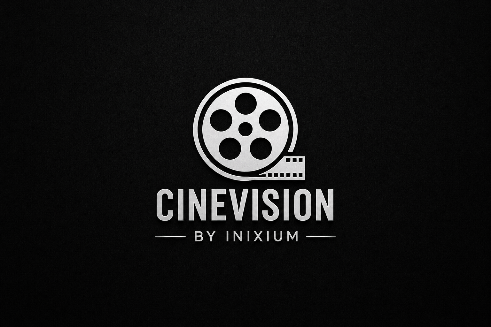

<div align="center">

</div>

# CineVision

A movie platform with two clients — a Telegram Bot and a REST API — built on top of a shared Clean Architecture core.

Search, personal watchlists, favorites, collections, ratings, reviews, profiles, and recommendations are implemented once in the application layer and exposed through different interfaces.

The project demonstrates scalable backend architecture, separation of concerns, testing, and production-oriented development practices.

[](https://github.com/Inixium/CineVision/actions)
[]()
[]()

---

# Why it's built this way

The first version of CineVision was a simple Telegram bot where handlers directly communicated with the database and external APIs.

That approach works for a small project, but becomes difficult to maintain when adding new clients, testing business logic, or scaling functionality.

The current version separates business logic from external interfaces:

- `domain/` and `application/` contain pure business rules;
- Telegram Bot and REST API are independent adapters;
- infrastructure implements external integrations;
- tests can run without real Telegram tokens or external services.

The core does not depend on Telegram, FastAPI, SQLAlchemy, or external APIs.

---

# Features

## User Features

🎬 **Movie Search**
- Live search through Kinopoisk API
- Posters, descriptions, ratings, genres and countries

📚 **Personal Library**
- Watchlist
- Favorites
- Viewing history

📂 **Collections**
- User-created movie collections

⭐ **Ratings & Reviews**
- 1-10 rating system
- Text reviews
- Average movie rating calculation

🔎 **Search History**
- Recent searches per user

🎯 **Recommendation Quiz**
- Genre and mood based recommendations

👤 **Profiles**
- Display name
- Birthday
- Balance

---

# Architecture

CineVision follows Clean Architecture / Hexagonal Architecture principles.

```
presentation/
    Telegram Bot (Aiogram)
    REST API (FastAPI)
        |
        ↓

application/
    Use Cases
    Business workflows
        |
        ↓

domain/
    Entities
    Value Objects
    Errors
    Interfaces
        |
        ↓

infrastructure/
    Database
    External APIs
    Implementations
```

## Main principles

- Business logic does not depend on frameworks
- External services are hidden behind interfaces
- Database can be replaced without rewriting business logic
- New clients can be added without changing the core

---

# Tech Stack

## Backend

- Python 3.12
- FastAPI
- Aiogram 3
- SQLAlchemy 2.0 Async
- Alembic
- Pydantic v2
- aiohttp

## Database

- SQLite (default)
- PostgreSQL ready through SQLAlchemy async layer

## Testing

- pytest
- pytest-asyncio
- aioresponses
- httpx testing client

Tests cover:

- domain logic
- application services
- repositories
- REST endpoints
- external API integrations

## Development Tools

- Docker
- Docker Compose
- GitHub Actions
- Ruff
- mypy strict mode

---

# Project Structure

```
src/movielib/

├── domain/
│   ├── entities
│   ├── value_objects
│   ├── errors
│   └── ports

├── application/
│   ├── films
│   ├── library
│   ├── collections
│   ├── ratings
│   ├── reviews
│   ├── users
│   └── quiz

├── infrastructure/
│   ├── persistence
│   ├── external
│   └── repositories

├── presentation/
│   ├── telegram
│   └── rest

└── bootstrap/
    ├── config.py
    ├── container.py
    └── application setup


tests/

├── unit
└── integration
```

---

# Getting Started

## Clone repository

```bash
git clone https://github.com/Inixium/CineVision.git

cd CineVision
```

## Create environment

```bash
python -m venv .venv
```

Windows:

```bash
.venv\Scripts\activate
```

Linux / macOS:

```bash
source .venv/bin/activate
```

Install dependencies:

```bash
pip install -e ".[dev]"
```

Create environment file:

```bash
cp .env.example .env
```

Configure:

```
BOT_TOKEN=
FILMS_API_TOKEN=
DATABASE_URL=
```

Apply migrations:

```bash
alembic upgrade head
```

---

# Running

## Telegram Bot

```bash
python -m movielib
```

## REST API

```bash
uvicorn movielib.bootstrap.rest_app:app --reload
```

Swagger documentation:

```
http://127.0.0.1:8000/docs
```

---

# Testing

Run all tests:

```bash
pytest
```

Unit tests:

```bash
pytest tests/unit
```

Integration tests:

```bash
pytest tests/integration
```

Code quality:

```bash
ruff check .
```

```bash
mypy src
```

---

# Deployment

The project is prepared for deployment using Docker.

Production workflow:

```bash
docker compose up -d --build
```

Features:

- Docker containerization
- automatic migrations
- persistent database storage
- GitHub Actions CI pipeline

---

# Future Improvements

- Web frontend client using existing REST API
- Advanced recommendation engine
- Analytics system
- Additional movie providers
- PostgreSQL production deployment
- Redis caching layer

---

# Contributing

Contributions and improvements are welcome.

Before opening a pull request:

- run tests;
- check formatting;
- verify type checking.

---

# License

MIT License